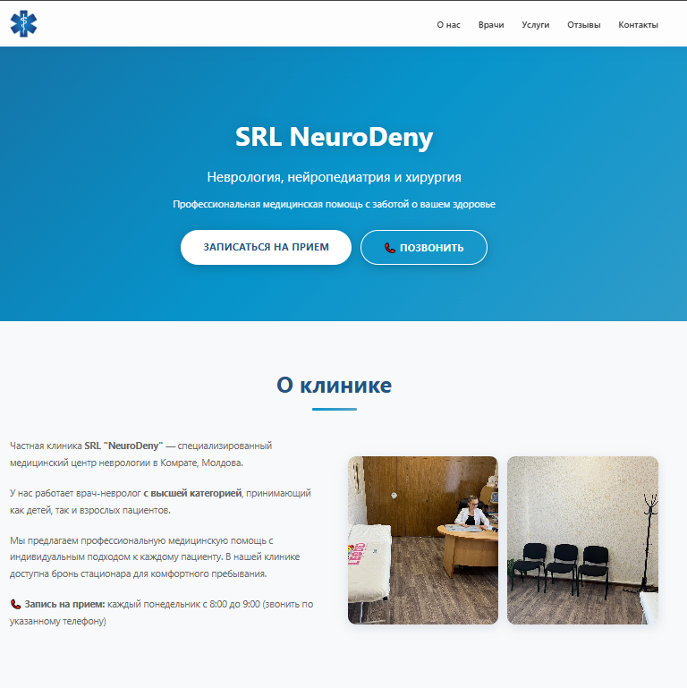
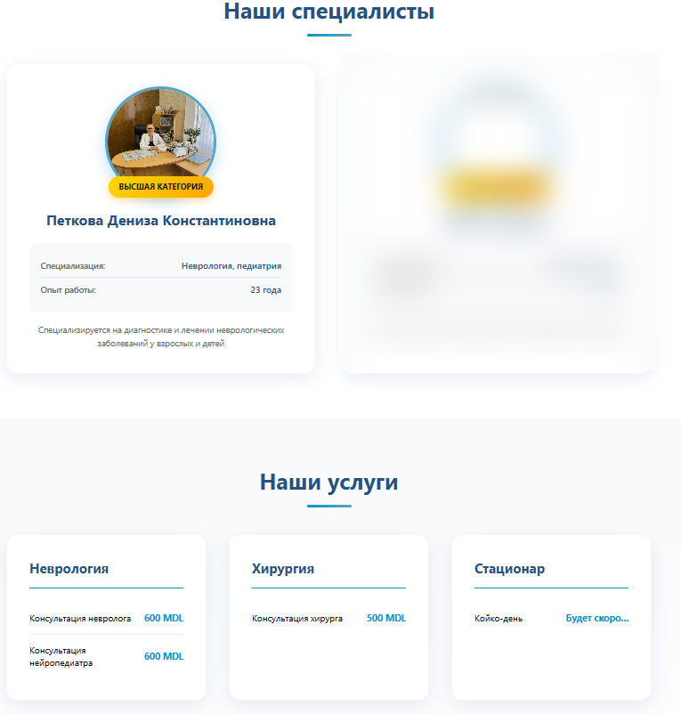
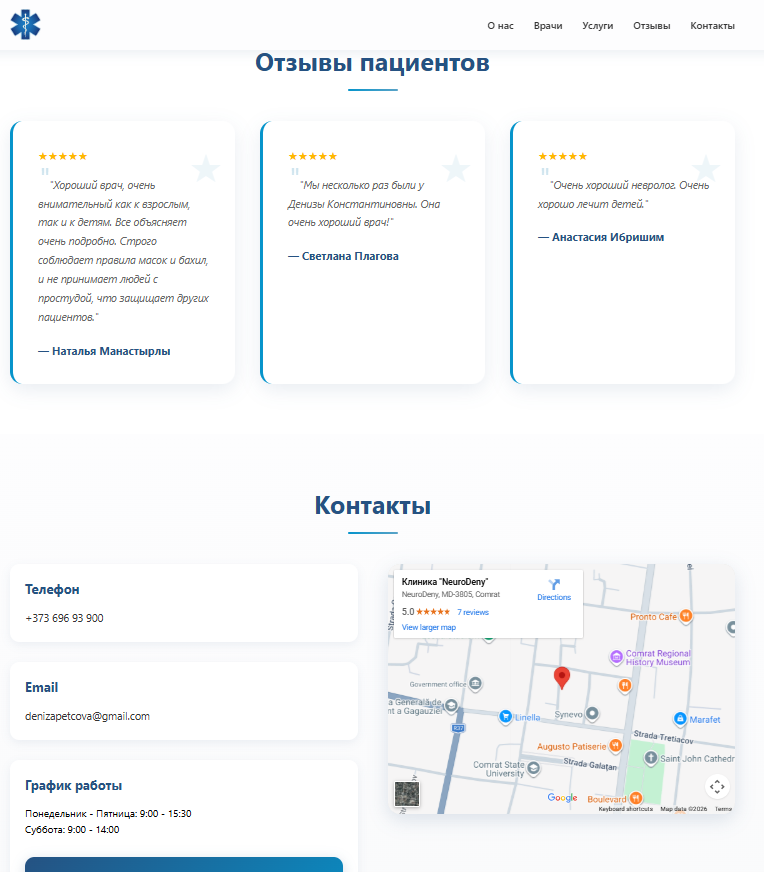
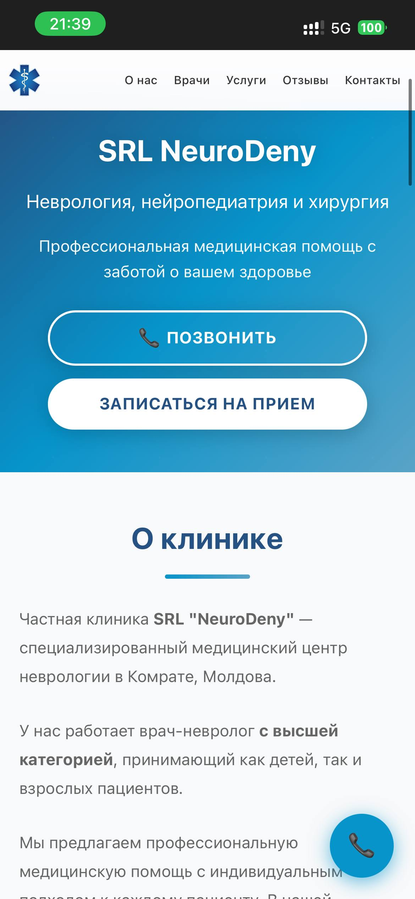
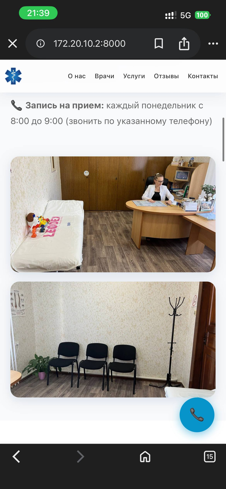
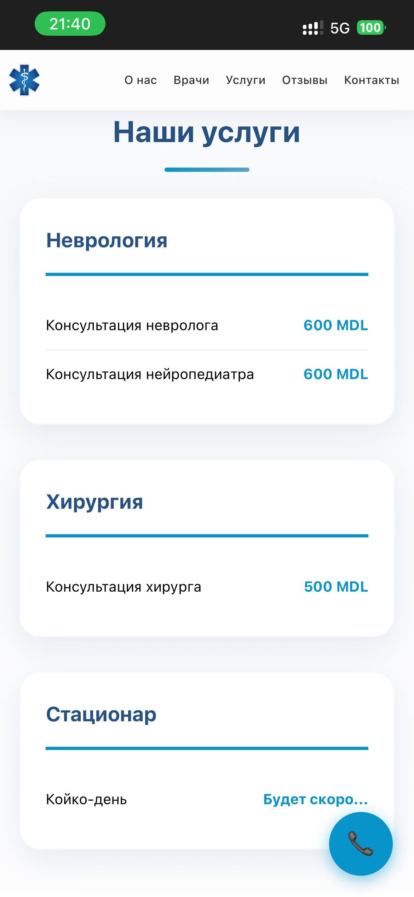
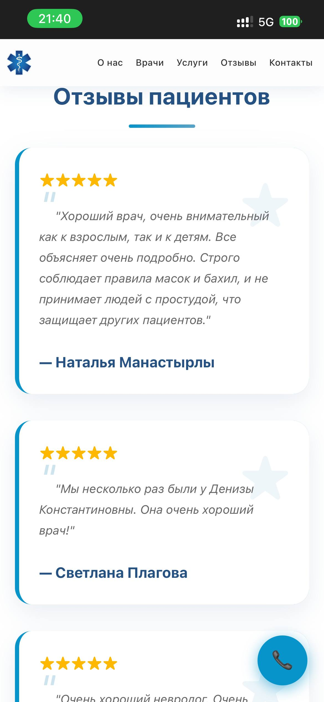
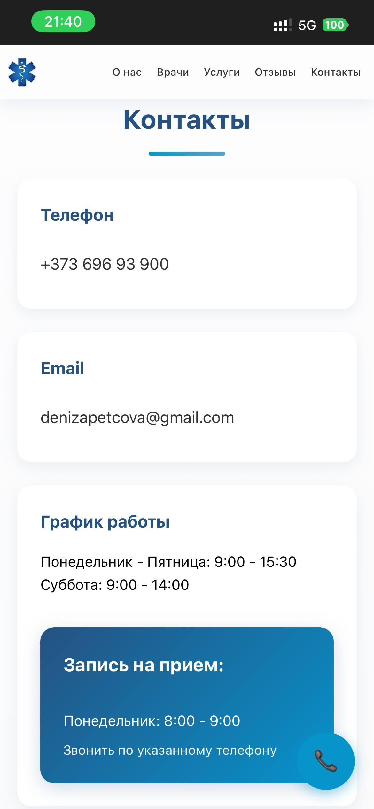
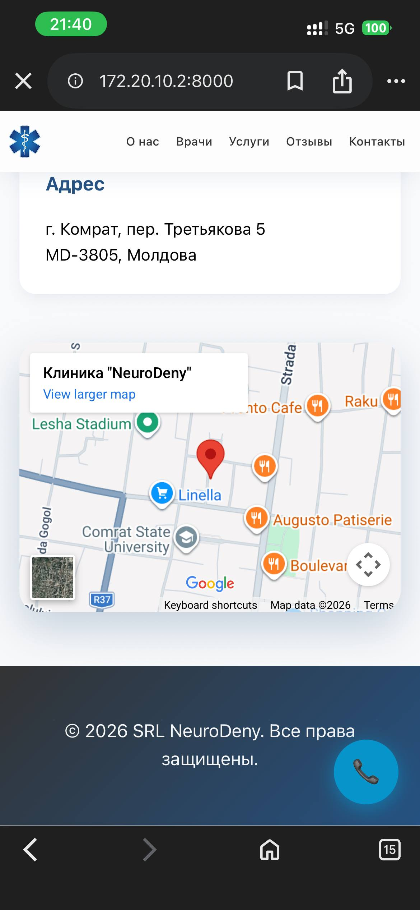

# 🏥 Lab 2 - Landing Page for SRL NeuroDeny Medical Clinic

A professional landing page for **SRL NeuroDeny** - a real medical clinic in Comrat, Moldova, specializing in neurology, neuropediatrics, and surgery.

> **Real Client Project:** This website was created for an actual medical clinic owned by my mother, a neurologist with the highest qualification category.

---

## 🔗 Live Demo

**[View Live Website →](https://nickseen.github.io/NeuroDeny/)**

---

## 📋 Project Description

This landing page was developed for SRL NeuroDeny medical clinic, providing professional healthcare services in:
- 🧠 **Neurology** - diagnosis and treatment of neurological disorders
- 👶 **Neuropediatrics** - specialized care for children
- 🏥 **Surgery** - general surgical procedures
- 🛏️ **Inpatient Care** - hospital bed reservations available

The clinic is led by Dr. Petkova Deniza Konstantinovna, a neurologist with highest qualification category and 23 years of experience.

---

## 📸 Screenshots

### Desktop View


*Hero section and navigation*


*Doctor cards with professional design*


*Services and contact section*

### Mobile View





*Responsive design optimized for mobile devices*





---

## ✅ Lab Requirements Compliance

### Customer Requirements
- ✅ **Navigation:** Smooth-scroll navigation bar with logo and menu links
- ✅ **Call to Action:** Multiple CTAs (appointment button, call button, floating phone)
- ✅ **6 Sections:** Hero, About, Doctors, Services, Reviews, Contact (exceeds minimum of 4)
- ✅ **Visual Design:** Professional medical aesthetic with brand colors, animations, and modern UI

### Dev Requirements
- ✅ **Vanilla CSS/HTML:** No frameworks used - pure HTML5 and CSS3
- ✅ **Git History:** 15+ commits showing progressive development
- ✅ **Deployment:** Live on GitHub Pages
- ✅ **README:** Complete documentation with description, tech stack, and live demo link

### Additional Features
- ✅ **Real Client:** Actual medical clinic with real content and photos
- ✅ **Responsive Design:** Mobile-first approach with breakpoints for tablets and desktop
- ✅ **SEO Optimization:** Meta tags, Schema.org markup, sitemap, robots.txt
- ✅ **Accessibility:** Semantic HTML, proper alt texts, ARIA labels
- ✅ **Performance:** Optimized images, clean CSS, fast loading

---

## 🎯 Website Sections

1. **Hero Section**
   - Clinic logo and branding
   - Headline with specialty areas
   - Dual CTAs: "Book Appointment" and "Call Now"
   - Gradient background with animations

2. **About Section**
   - Clinic description and philosophy
   - Office photos (2 real images)
   - Appointment schedule information
   - Highlights of services

3. **Doctors Section**
   - Doctor profiles with photos
   - Qualification badges (highest category)
   - Specialization and experience details
   - Professional card design with hover effects

4. **Services Section**
   - 3 service categories: Neurology, Surgery, Inpatient
   - Pricing in MDL (Moldovan Leu)
   - Detailed service descriptions
   - Modern card-based layout

5. **Reviews Section**
   - 3 real Google Maps reviews (5-star ratings)
   - Patient testimonials
   - Reviewer names and dates
   - Social proof for credibility

6. **Contact Section**
   - Phone: +373 696 93 900
   - Email: denizapetcova@gmail.com
   - Address: Comrat, Tretyakova 5, MD-3805, Moldova
   - Working hours and appointment schedule
   - Embedded Google Maps
   - Floating call button (mobile)

---

## 🚀 Technologies Used

- **HTML5** - Semantic markup, Schema.org structured data
- **CSS3** - Custom properties, flexbox, grid, animations
- **Git** - Version control with meaningful commit messages
- **GitHub Pages** - Free hosting and automatic deployment

**No frameworks or libraries** - everything built from scratch with vanilla code.

---

## 📂 Project Structure

```
NeuroDeny/
├── index.html                 # Main landing page
├── css/
│   ├── reset.css             # CSS reset for cross-browser consistency
│   └── style.css             # All custom styles (~1000 lines)
├── images/
│   ├── logo/                 # Clinic logo
│   ├── doctors/              # Doctor photos
│   ├── clinic/               # Office photos
│   └── business-card/        # Brand colors reference
├── robots.txt                # SEO: crawler instructions
├── sitemap.xml               # SEO: sitemap for search engines
├── google356c63625b25c074.html # Google Search Console verification
└── README.md                 # This file
```

---

## 🎨 Design Features

- **Color Palette:** Extracted from clinic's business card
  - Primary: `#255282` (Professional Blue)
  - Secondary: `#0694CB` (Medical Cyan)
  - Accent: `#5AA3C7` (Light Blue)
  
- **Typography:** System fonts for fast loading and readability

- **Animations:** Subtle fade-ins, hover effects, and smooth transitions

- **Responsive:** 3 breakpoints (mobile: 480px, tablet: 768px, desktop: 992px+)

---

## 🌐 SEO Optimization

- 70+ relevant keywords (невролог комрат, нейропедиатр, neurology Moldova)
- Open Graph tags for social media sharing
- Twitter Card metadata
- Schema.org MedicalClinic structured data
- Google Search Console verification
- Sitemap submitted for indexing

---

## 📱 Contact Information

**SRL NeuroDeny Medical Clinic**

📍 Address: Comrat, Tretyakova Lane 5, MD-3805, Moldova  
📞 Phone: [+373 696 93 900](tel:+37369693900)  
📧 Email: denizapetcova@gmail.com  
⭐ Google Rating: 5.0/5.0 (based on patient reviews)

**Working Hours:**
- Monday - Friday: 9:00 - 15:30
- Saturday: 9:00 - 14:00

**Appointments:**
- Monday: 8:00 - 9:00 (call for booking)

---

## 💻 Local Development

1. Clone the repository:
```bash
git clone https://github.com/Nickseen/NeuroDeny.git
cd NeuroDeny
```

2. Open in browser:
```bash
# Option 1: Direct open
open index.html

# Option 2: Local server (recommended)
python3 -m http.server 8000
# Then visit http://localhost:8000
```

---

## 📝 License

© 2026 SRL NeuroDeny. All rights reserved.

---

## 👨‍💻 Development

**Project Type:** Lab 2 - Landing Page  
**Year:** 2026  
**Status:** ✅ Deployed and Live  
**Grade Target:** Maximum (real client + exceeds requirements)
