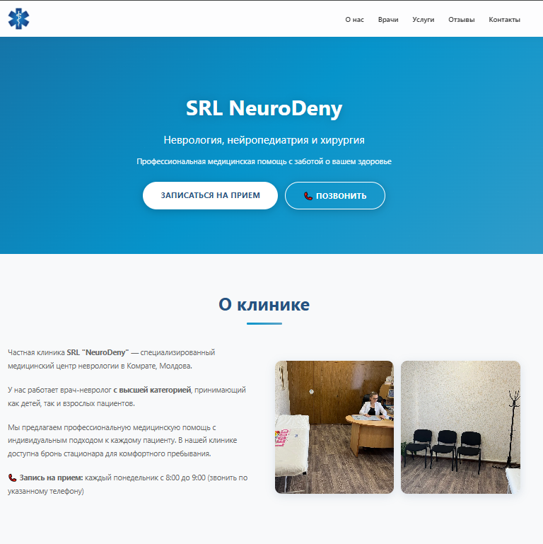
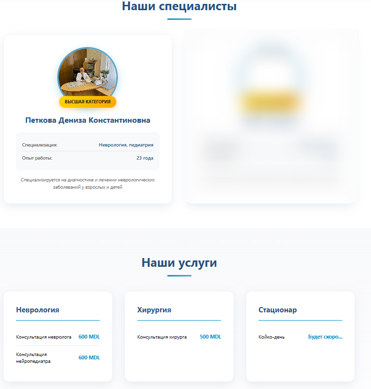
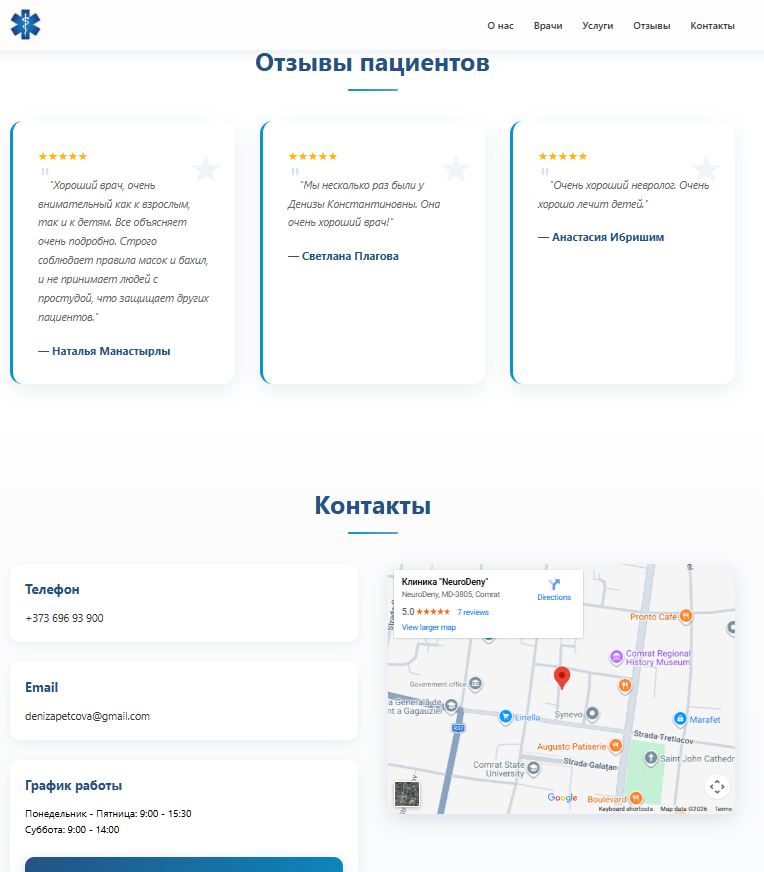
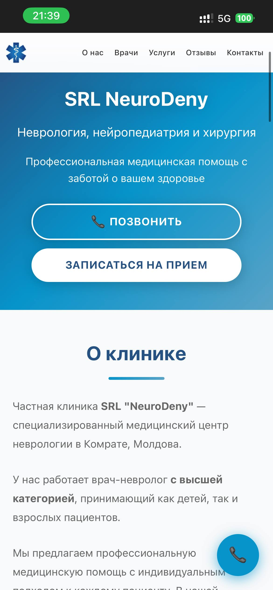
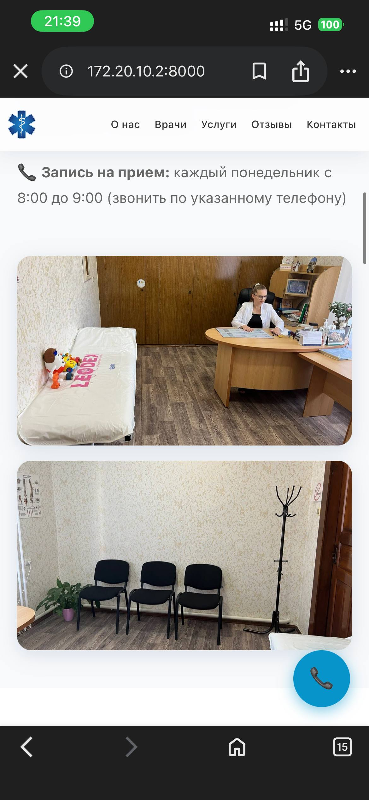
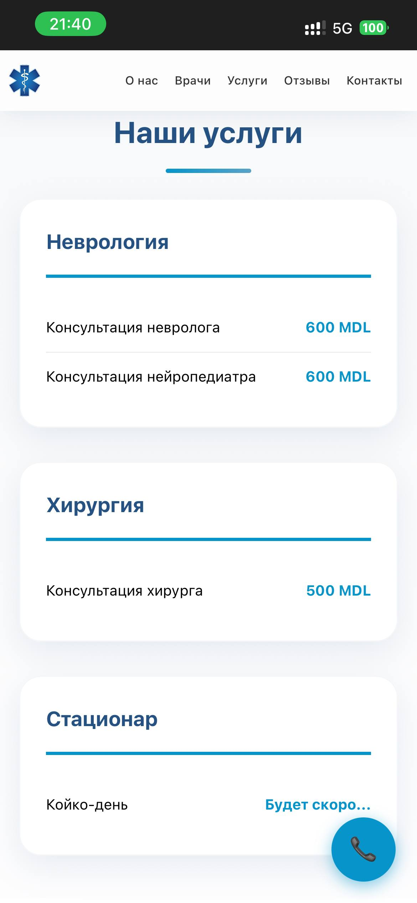

# Lab 4 - Static Site Generator & Git CMS — SRL NeuroDeny

Landing page for **SRL NeuroDeny** medical clinic in Comrat, Moldova, migrated to a static site generator with a Git-based CMS for content management.

> **Real Client Project:** Website for an actual medical clinic owned by my mother, Dr. Petkova Deniza Konstantinovna — neurologist, highest qualification category, 23 years of experience.

---

## Live Demo

**[View Website](https://nickseen.github.io/NeuroDeny/)**
**[Open CMS Admin](https://nickseen.github.io/NeuroDeny/admin/)**

---

## Lab Requirements

| Requirement | Solution |
|---|---|
| Static Site Generator | Eleventy (11ty) v3 |
| Git-based CMS | Sveltia CMS |
| CSS framework from Lab 3 | Custom CSS (`css/style.css`) + Tailwind CDN |
| Content editable via CMS | Doctors, Services, Reviews, Settings, Blog |
| Deployed live | GitHub Pages via GitHub Actions |
| Decent git history | 15+ meaningful commits |

---

## CMS — How to Use

1. Go to [/admin/](https://nickseen.github.io/NeuroDeny/admin/)
2. Click **"Sign in with Token"**
3. Generate a GitHub Personal Access Token with `repo` scope at https://github.com/settings/tokens
4. Paste the token — admin panel opens

**Editable content:**
- **Settings** — clinic name, SEO, contacts, working hours, social links
- **Doctors** — name, specialty, experience, photo
- **Services** — categories and prices
- **Reviews** — patient reviews with rating
- **Blog** — create and edit articles

Any save in the CMS creates a commit in the repository → GitHub Actions rebuilds and deploys the site automatically.

---

## Tech Stack

- **[Eleventy (11ty)](https://www.11ty.dev/)** — Static Site Generator, Nunjucks templates
- **[Sveltia CMS](https://github.com/sveltia/sveltia-cms)** — Git-based CMS, drop-in replacement for Decap CMS
- **Custom CSS** — from Lab 3 (`css/style.css`, `css/reset.css`)
- **Tailwind CSS** — via CDN, used for footer and floating button
- **GitHub Actions** — automatic build and deploy on push to master
- **GitHub Pages** — free hosting

---

## Project Structure

```
NeuroDeny/
├── src/
│   ├── index.njk              # Main page template
│   ├── _layouts/
│   │   ├── base.njk           # Base layout (SEO, CSS, Schema.org)
│   │   └── blog-post.njk      # Blog article layout
│   ├── _includes/
│   │   ├── navigation.njk
│   │   ├── footer.njk
│   │   ├── mascot.njk
│   │   └── scripts.njk
│   ├── _data/
│   │   ├── settings.json      # Site settings (CMS-editable)
│   │   ├── doctors.json       # Doctors (CMS-editable)
│   │   ├── services.json      # Services & prices (CMS-editable)
│   │   └── reviews.json       # Reviews (CMS-editable)
│   ├── admin/
│   │   ├── index.html         # CMS entry point
│   │   └── config.yml         # CMS configuration
│   └── blog/                  # Blog articles (Markdown)
├── css/
│   ├── reset.css
│   └── style.css              # Main styles from Lab 3
├── images/                    # Static images
├── .github/workflows/
│   └── deploy.yml             # GitHub Actions CI/CD
├── .eleventy.js               # Eleventy configuration
└── package.json
```

---

## Local Development

```bash
git clone https://github.com/Nickseen/NeuroDeny.git
cd NeuroDeny
npm install
npm start        # dev server at localhost:8080
npm run build    # production build → _site/
```

---

## Screenshots

### Desktop





### Mobile

  

---

© 2026 SRL NeuroDeny. All rights reserved.
